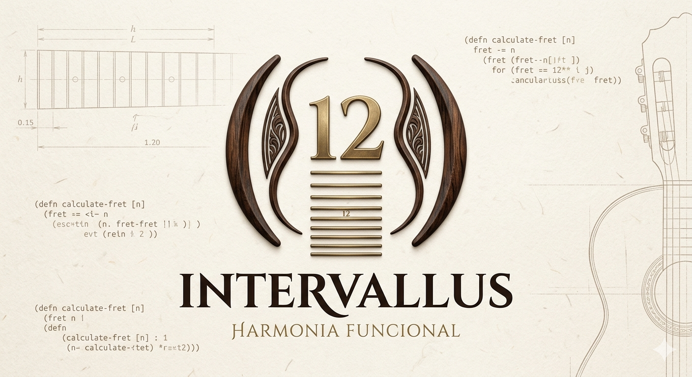

  



# ***<span style="color:white;">Intervallus - harmonia funcional</span>***
### API e Servidor Web desenvolvido em Clojure para calcular e renderizar a posição exata dos trastes em instrumentos de cordas com afinação temperada.

---

## **<span style="color:white;">Integrantes</span>**

| Alunos                       | R.A        | Github           |Cargo             |
|------------------------------|------------|------------------|------------------|
| [Luana Ferreira Silva](https://github.com/luafxrreira)         | 25.01656-9 | @luafxrreira     | Desenvolvedor(a) |

---

## **<span style="color:white;">Estrutura do projeto</span>**
```
INTERVALLUS/                                    # Raiz do projeto
├── 📁 backend/
│   └── 📁 intervallus/                         # Pasta do backend
│       ├── 📁 src/
│       │   └── 📁 intervallus/                 # Namespace principal
│       │       │── 📁 target/ 
│       │       │── 📄 calculos.clj             # Lógica matemática
│       │       │── 📄 core.clj                 # Código principal
│       │       │── 📄 lein.ps1                 # Init do servidor
│       │       │── 📄 rotas.clj                # Endpoints
│       ├── 📁 test/
│       │   └── 📁 intervallus/
│       │       └── 📄 core_test.clj           # Testes
│       ├── 📄 .gitignore                      # Git ignore backend
│       └── 📄 project.clj                     # Dependências
│
├── 📁 frontend/
│   |── 📁 css   
|   |    └── 📄 style.css                      # Estilização completa do painel
│   ├── 📄 index.css                           # Template interpretado pelo servidor 
├── 📄 .gitignore                              # Git ignore raiz
├── 📄 harmonia_funcional.png                  # Imagem README
└── 📄 README.md                               # Documentação 
```

## **<span style="color:white;">Funcionalidades</span>**  
* **Cálculo de Trastes Preciso:** Determina a distância de cada traste em relação à pestana e à ponte com base no comprimento da escala informado.
* **Mapeamento de Notas Musicais:** Identifica automaticamente a nota musical correspondente a cada traste (escala cromática a partir de Dó).
* **Barra de Métricas de Luthieria:** Exibe informações cruciais como o ponto médio exato da corda (12º traste) e a largura do primeiro espaçamento.
* **Proporção Visual:** Gera barras de preenchimento dinâmicas no próprio HTML indicando visualmente o estreitamento dos trastes ao longo do braço.
* **Arquitetura SSR (Server-Side Rendering):** Todo o processamento lógico, matemático e de montagem de componentes acontece no servidor, entregando HTML puro ao navegador de forma leve e rápida.

## **<span style="color:white;">Tecnologias utilizadas</span>**

<p align="left">
   <p align="left">
    <a href="https://www.clojure.org/index" target="_blank" rel="noreferrer">
        
    </a>
    <a href="https://git-scm.com/" target="_blank" rel="noreferrer">
        
    </a>
    <a href="https://developer.mozilla.org/pt-BR/docs/Web/HTML" target="_blank" rel="noreferrer">
        
    </a>
    <a href="https://developer.mozilla.org/pt-BR/docs/Web/CSS" target="_blank" rel="noreferrer">
        
    </a>
</p>

* **Clojure:** Linguagem principal baseada em paradigma funcional.
* **Leiningen:** Ferramenta de automação e gerenciamento de dependências do ecossistema Clojure.
* **Ring & Compojure:** Bibliotecas utilizadas para interceptar requisições HTTP, estruturar

## **<span style="color:white;">Como executar</span>**
## **Pré-requisito**
Antes de começar, você precisará ter instalado em sua máquina o [Java JDK](https://www.oracle.com/java/technologies/downloads/) (versão 11 ou superior) e o gerenciador [Leiningen](https://leiningen.org/).

1. Abra o terminal e navegue até o diretório interno do backend:
   ```bash
   cd backend/intervallus

2. Baixe as dependências configuradas no projeto:
Bash
        
        lein deps

3. Inicie o servidor web local:
Bash

        lein run
4. O servidor iniciará por padrão na porta 3000. Abra o seu navegador e acesse:

        http://localhost:3000


## **<span style="color:white;">Licença</span>**  
### Este projeto foi desenvolvido como parte do Projeto Integrador Interdisciplinar do Instituto Mauá de Tecnologia em parceria com o Metrô de São Paulo.

## **<span style="color:white;">Contato</span>**
### Para mais informações sobre o projeto, entre em contato com a equipe de desenvolvimento através do(s) perfil(s) do GitHub listado(s) acima.
